# 2022《计算机网络》实验报告：Http 客户端和服务端的模拟（Socket 编程） 

### 团队组成

| 小组成员 | 分工   |
| -------- | ------ |
| 陈凯文   | 客户端 |
| 蔡之恒   | 服务端 |
| 孙立帆   | 长连接 |
| 王福森   | 服务端 |
| 熊丘桓   | 客户端 |

### 启动方式

需要先启动类ServerMain中的main方法，再启动测试代码或者ClientMain中的main方法。

## 一、功能展示

### 服务端

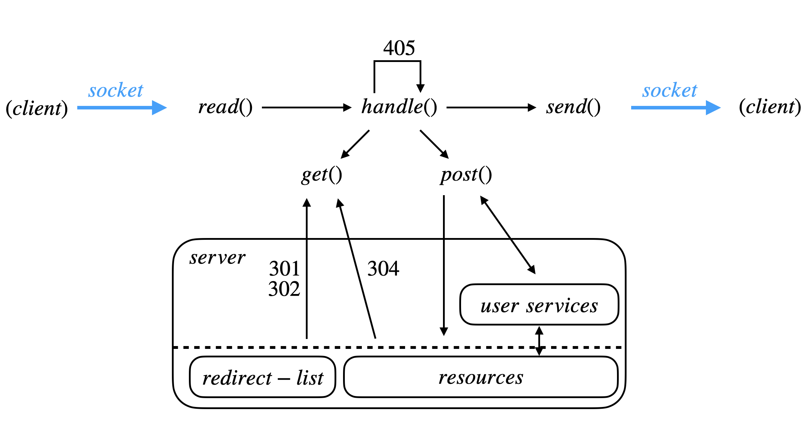

如图所示，服务端从 socket 连接中先读取客户端传输的请求，然后处理该请求，最后将处理后的结果封装成相应的响应报文并通过 socket 连接重新传输给客户端。

在处理过程 `handle()`中，服务端会根据请求类型分为 `get` 和 `post` **分别处理**，本次实现仅支持这两种请求，对于其他请求，服务端简单地返回 405 。

在请求过程中，服务端处理程序需要与**服务器上的资源**进行**交互**，图中的箭头指示交互的方向。除去服务端的处理程序，服务端的所有"资源"（广义）都展示在了下图的黑色方框中。
这其中有较为高层的"用户服务"，也有较为低层的"重定向列表"和各种"资源文件"。关于"用户服务"的实现将在下文中详细介绍。部分容易标识的状态返回码也已经标识在图中。

### 客户端

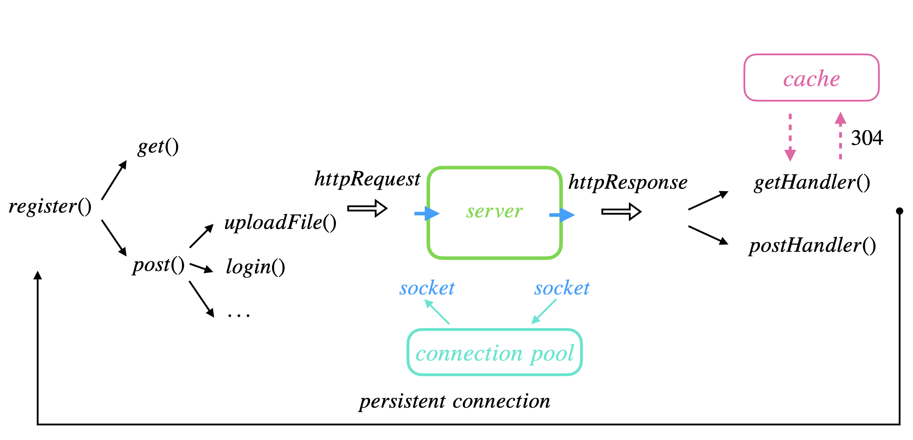

客户端在初始化时，首先需要进行注册，然后根据需要使用的服务封装相应的请求，图中列出了本次实现中支持的服务。

封装完成后，通过 socket 连接传输给服务器，同时也通过同一个 socket 连接获取服务器返回的响应。在获取返回的响应后，通过 `getHandler` 和 `postHandler` 分流处理。处理完毕后，若是长连接，则返回全流程的开头，**开始下一次 封装、发送、接收、处理 的循环。**

图中用不同颜色标出了两个具体的实现，一个是线程池，客户端通过连接池来管理与服务端的所有 socket 连接，在传输时获取一个连接，并在接收结束时将连接交换给连接池（暂不考虑长连接）；
另一个就是 本地缓存，本地缓存能够使服务器在接收到 304 返回值时找到对应的资源。**具体实现都会在下文中展开。**

## 二 界面展示

### 1、客户端

#### 登录注册功能

`第一次启动客户端，提示需要注册`


`重新登录`


`输入未注册过的账户名和密码，自动注册并登录新的账户`


#### 301，302状态码

##### 简述

[**301  Moved Permanently**](https://link.jianshu.com?t=https://zh.wikipedia.org/wiki/HTTP_301)：永久性重定向。
 表示请求的资源已被永久分配了新的URI。可以简单理解为该资源已经被永久改变了位置。

[**302  Found**](https://link.jianshu.com?t=https://zh.wikipedia.org/wiki/HTTP_302):临时性重定向。
 表示资源被**临时**改变位置并分配了新的URI。

在本次项目中，服务端维护了RedicectList来记录发生会重定向的资源以及其对应的重定向目的地

`请求获取/301origin.html 发生转发`

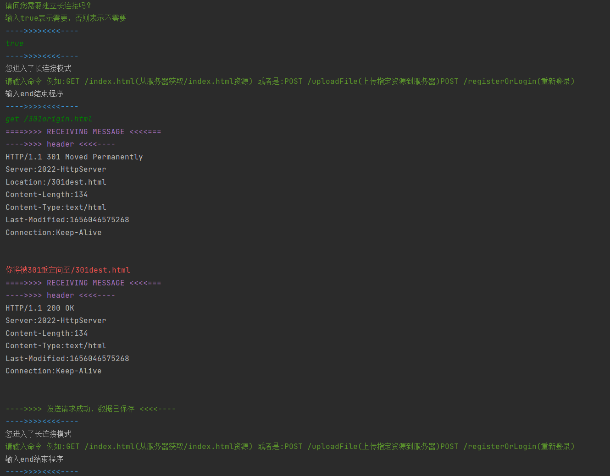

`请求获取/302origin.html 发生转发`

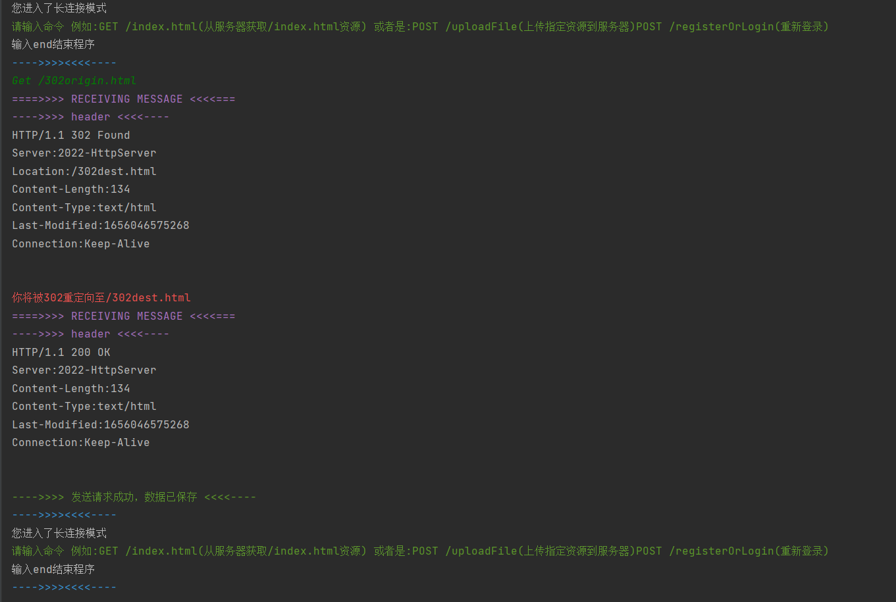


#### 304状态码

##### 简述：

客户端连续利用GET请求企图获取同一未修改过的资源，自第二次请求器服务器端会返回304状态码，客户端会直接从缓存中获取该资源

`第一次利用GET请求获取资源`

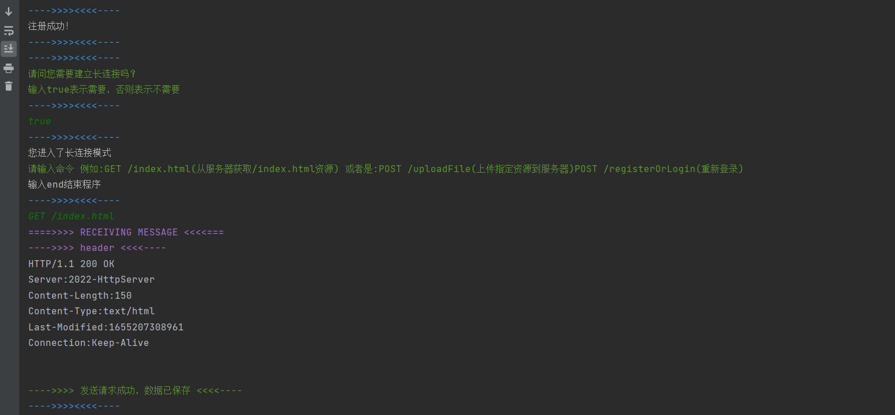

`第二次利用GET请求获取该资源，第三次，第四次等同理`


#### POST请求（以上传文件为例）

##### 简述：

客户端对于POST请求的实现类似于GET请求，只是对与请求报文的封装有所不同，具体内容可查看Post类代码中的encapsulateRequest方法。

本项目中登录注册（RegisterOrLogin），上传文件给服务器端（uploadFile）都是通过POST请求实现的，要想扩展功能，只需在NormalClient类中增添方法，调用POST请求即可，具有良好的可扩展性。

`客户端上传文件`

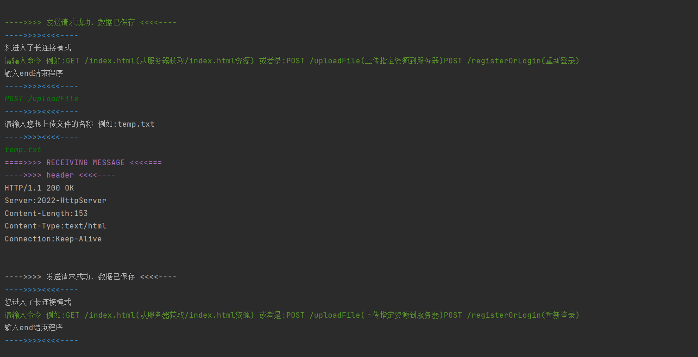

##### 长连接

长连接 (persistent connection) 指的是多个连续的 http 请求复用同一个 TCP 连接，以减少反复建立和释放 TCP 连接带来的开销。


可以看到这两个请求中只有一个连接对象被创建。

#### 多种MIME支持

在MIMETypes类中记载了可以支持的传输类型，主要分为视频部分，图片部分，文本部分，字体部分，音频部分等。即文本文件与二进制文件均课支持，客户端可以从服务器端获取文本文件与二进制文件，也可以上传文本文件与二进制文件

`客户端获取文本文件`

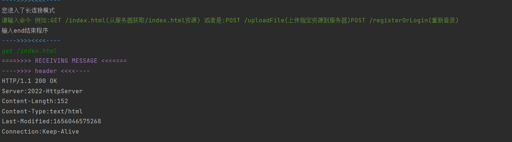

`客户端获取二进制文件`

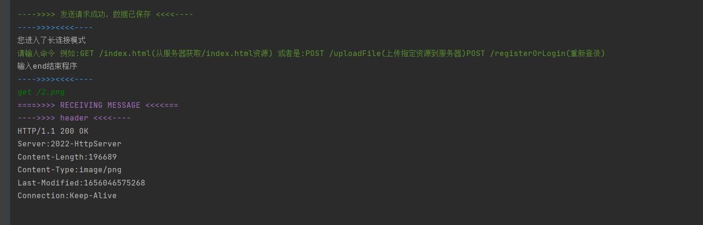

`客户端上传文本文件`

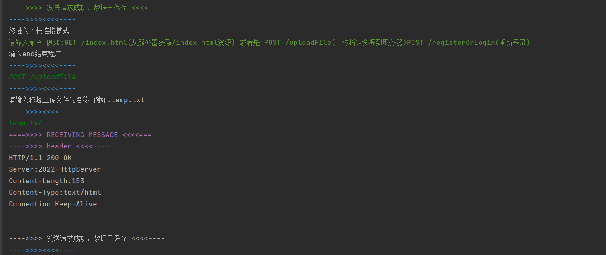

`客户端上传二进制文件`

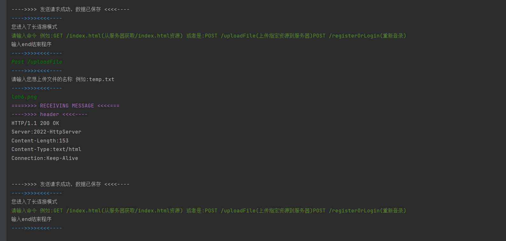

### 2、服务端

#### 登录注册功能

`第一次启动客户端时：服务器会打印出请求头以及请求行 `

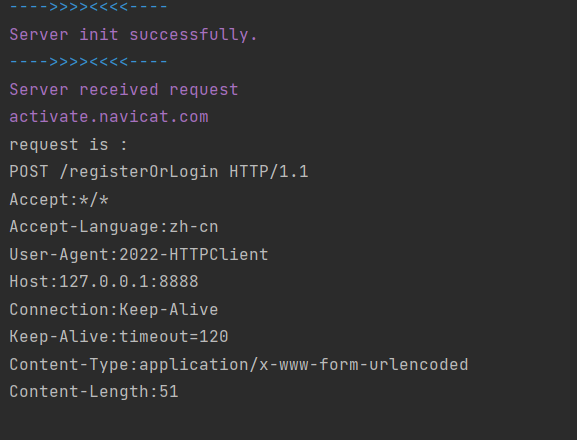

`分别输入不同的账户名密码时，服务器会打印出请求头以及请求行，当然因为请求体内容不同，Content-Length属性值也不同`


#### 301，302状态码

`客户端请求301origin`

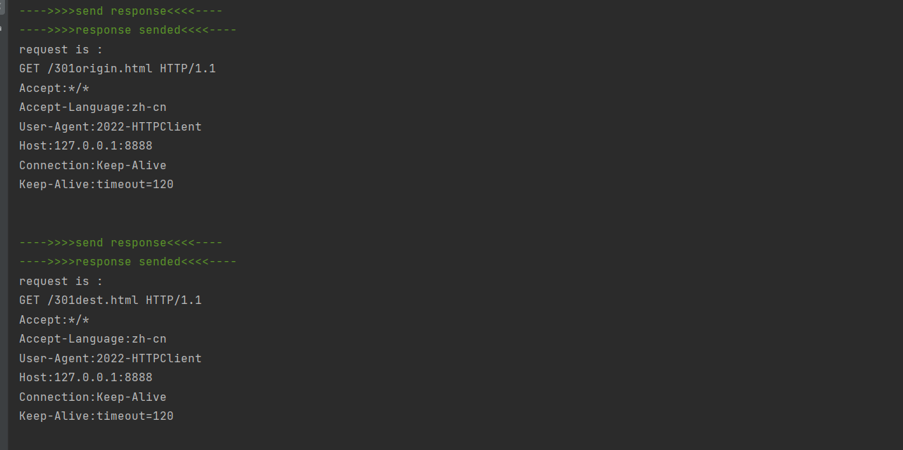

`客户端请求302origin`

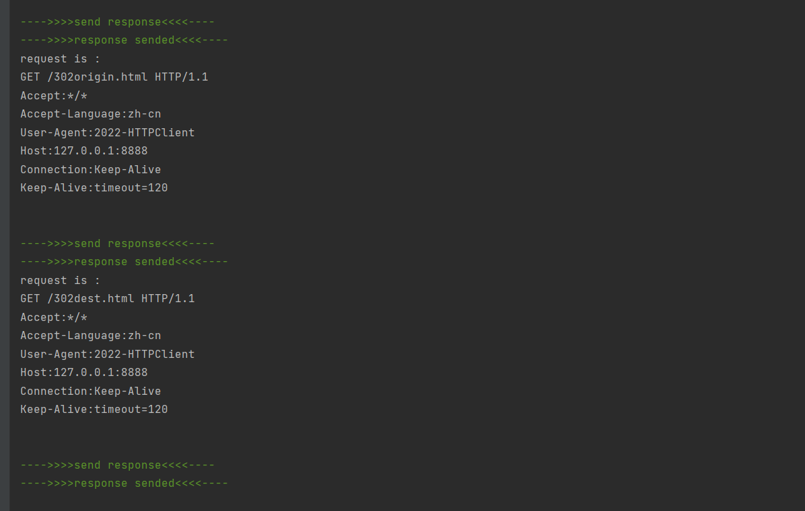

#### 304状态码

`客户端连续GET请求/index.html资源情况下，服务器打印请求头请求行信息如下：`


#### POST请求（以上传文件为例）

#### 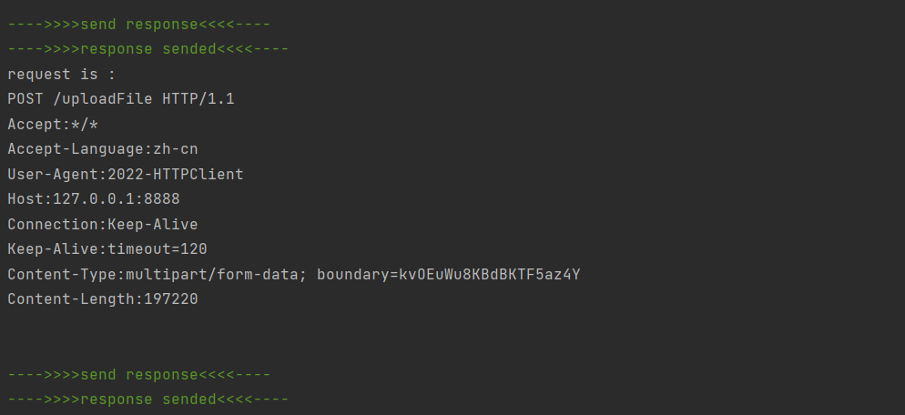

#### 长连接

在未启用长连接时处理完一个请求 TCP 连接关闭。


开启长连接后处理完一个请求 TCP 连接不关闭。


#### 多种MIME支持

`与客户端请求相对应的输出结果为`


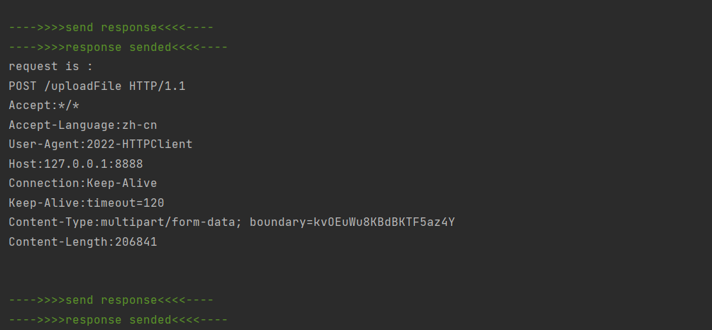

## 二、技术点

### 客户端

#### 策略模式，可扩展性强

类图如下：

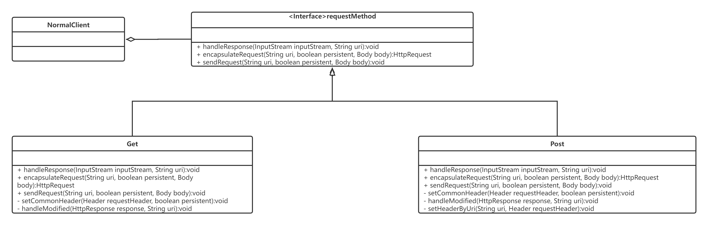

客户端发送请求时可以选择GET或者POST方法，之后需要新增方法只需要新建继承于requestMethod的类即可，可扩展性强。

#### 连接池

- 用 Connection 对象来封装连接（主要是 socket 和一些配置属性以及状态属性），并用连接池类来对连接进行管理，开启长连接的模式下每次需要发送一个新的请求的时候先从连接池中取，以减少多次创建和销毁连接对象的开销，以及实现对长连接功能的支持。

#### 本地缓存，性能高

- 实现了本地缓存，如果本地保存的版本和上次访问时相同，那么直接采用本地缓存的版本，不再让服务器发送副本，提高效率。

#### 长连接

- 通过连接池来管理连接，多次请求都从连接池中取同一个连接对象来使用，以实现长连接。

### 服务端

#### MIME 支持面大

在服务端的实现过程中，将文件视为二进制流进行传输，可适应多种文件格式，MIME 支持面大。

#### 提供用户服务的编程接口，可编程

我们认为，POST 请求需要用户提供服务才能体现其价值，而用户提供的服务应当作为高层程序“部署”在服务器上，因此抽象了用户服务的编程接口：

```java
public abstract class UserServiceProvider {
    public String bindUri;
    abstract public HttpResponseReturnValue handle(String arg1, String arg2, String arg3);
}
```

用户可以继承这个抽象类并实现抽象函数 `handle` ，该函数需要处理在 POST 请求中提供的若干个参数并告知服务器应该返回的结果 `HttpResponseReturnValue`。

在本次实现中，简单起见，我们规定 POST 中最多携带 3 个参数，服务器在解析请求时将传入的所有参数（包括文件二进制流）作为 `String` 类型解释。客户端程序和服务端程序可以通过某种协议进行交互。

## 三、关键代码解析

### 登陆注册

#### 简述		

当用户首次使用客户端时，会强制要求其注册，若选择建立长连接，那么之后用户输入POST /registerOrLogin方法便可以实现重新注册或者是登录操作

#### NormalClient类中登陆注册方法的实现

```java
public boolean RegisterOrLogin(String input, boolean persistent) throws IOException {
        byte[] bodyBytes=input.getBytes();
        Body body = new Body(bodyBytes);
        try {
            //调用POST请求发送登录注册的请求
            requestMethod.sendRequest("/registerOrLogin", persistent, body);
        } catch (IOException e) {
            e.printStackTrace();
        }
        //读取服务端传回的结果
        FileReader fileReader=new FileReader( "src/main/java/client/Resources/registerOrLogin");
        BufferedReader bufferedReader=new BufferedReader(fileReader);
        String s;
       while (!(s = bufferedReader.readLine()).isEmpty()){
           if(s.contains("Successfully")){
               if(s.contains("Register")){
                   TextDecoration.printBlue(TextDecoration.Head);
                   System.out.println("注册成功！");
                   TextDecoration.printBlue(TextDecoration.Head);
               }
               else if(s.contains("Login")){
                   TextDecoration.printBlue(TextDecoration.Head);
                   System.out.println("登录成功！");
                   TextDecoration.printBlue(TextDecoration.Head);
               }
               return true;
           }
           if(s.contains("Fail")){
               TextDecoration.printBlue(TextDecoration.Head);
               System.out.println("您输入的密码有误，请重试或者重新注册账号！");
               TextDecoration.printBlue(TextDecoration.Head);
               return false;
           }
       }
        return false;
    }
```

#### Post（具体策略类）中sendRequest方法的实现

```java
    public void sendRequest(String uri, boolean persistent,Body body) throws IOException {
         Connection conn = null;

        try {
            //从连接池中获取连接
            conn = pool.getConnection(host, port, persistent);
        } catch (IOException e) {
            e.printStackTrace();
        }
        //encapsulate post request
        HttpRequest request = encapsulateRequest(uri, persistent, body);

        OutputStream socketOut = conn.getSendStream();
        //send to server
        socketOut.write(request.toBytes());

        InputStream inputStream = conn.getRecvStream();

        handleResponse(inputStream, uri);

        if(!persistent) pool.removeConnection(host);
    }

```

#### 连接池

连接类的对外接口(省略了 `getter` 和 `setter`)

```java
public class Connection {

    public Connection(String host, int port, boolean isKeepAlive)
        
    public void create();

    public boolean isKeepAlive(){return isKeepAlive;}

    public boolean isClosed();

    public void close();
}
```

连接池类的对外接口

```java
public class ConnectionPool {
    public Connection getConnection(String host, int port, boolean persistent) throws IOException;

    public void removeConnection(String host);
}
```

比较重要的是 `getConnection` 方法: 先尝试从连接池获取，如果获取不到再创建新的连接，加入连接池并返回

```java
public Connection getConnection(String host, int port, boolean persistent) throws IOException {
        Connection conn = pool.get(host);
        if(conn != null){
            if(conn.isClosed()){
                pool.remove(host);
            }else {
                return conn;
            }
        }
        conn = new Connection(host, port, persistent);
        pool.put(host, conn);
        conn.create();

        return conn;
    }
```

#### 本地缓存

LocalStorage 类的对外接口

```java
public class LocalStorage {
    public LocalStorage(long timeStamp, Body body);

    public long getTimeStamp();

    public void setTimeStamp(long timeStamp);

    public Body getBody();

    public void setBody(Body body);
}
```

本地缓存需要保存二进制数据和时间戳，时间戳用于版本比对。

### 重定向 301 302的实现

在本次项目中，服务端维护了RedicectList来记录发生会重定向的资源以及其对应的重定向目的地,通过RedicectList的query方法查询是否需要重定向

```java
public class RedirectList {
    //单例模式，使得只有一个重定向列表
    private static RedirectList redirectList = null;
    public static HashMap<String, String> redirectLists = new HashMap<>();
    public static HashMap<String, Integer> redirectTypes = new HashMap<>();
    private boolean isDebug = true;
    /**
     * 私有构造方法并进行重定向列表初始化
     */
    private RedirectList(){
        if(isDebug) {
            redirectLists.put("/301origin.html", "/301dest.html");
            redirectTypes.put("/301origin.html", 301);
            redirectLists.put("/302origin.html", "/302dest.html");
            redirectTypes.put("/302origin.html", 302);
        }
        else{
            String path = "";
            System.out.println("请输入重定向列表文件路径");
            BufferedReader bf = new BufferedReader(new InputStreamReader(System.in));
            try {
                path = bf.readLine();
            } catch (IOException e) {
                e.printStackTrace();
            }
            paraseConfig(path);
        }
    }

    /**
     * 获得单例定向
     * @return 单例对象
     */
    public static RedirectList getRedirectList(){
        if(RedirectList.redirectList == null){
            RedirectList.redirectList = new RedirectList();
        }
        return RedirectList.redirectList;
    }

    /**
     * 在重定向列表中查询URI
     * @param originURI 源URI
     * @return 不在则返回空字符串，在则返回字符串：状态码+目的URI
     */
    public String query(String originURI){
        if(!redirectLists.containsKey(originURI)){
            return "";
        }
        else{
            return redirectTypes.get(originURI) + redirectLists.get(originURI) ;
        }
    }


    /**
     * 从配置文件中读取重定向列表
     * @param path 配置文件路径
     */
    private void paraseConfig(String path) {
        String []line;
        File file = new File(path);
        try (BufferedReader reader = new BufferedReader(new FileReader(file))) {
            String tempString;
            while ((tempString = reader.readLine()) != null) {
                line = tempString.split("\\s+");
                redirectLists.put(line[0], line[1]);
                redirectTypes.put(line[0], Integer.parseInt(line[2]));
            }
        } catch (IOException e) {
            System.out.println("配置文件读取失败");
        }
    }
}
```

### 服务端304的实现

在本次实现中，我们对“何时返回 304”这个问题做出简单的假设：在同一次连接（可能为长连接）中，当用户两次 `get` 一份**相同的**且**未经修改的**的资源的时候，服务器返回 304 。

为了满足这个假设，需要两个条件（加粗项），因此我们在服务器端引入了资源管理机制，具体来说为工具类 `FileTable` ，定义如下：

```java
public class FileTable {
    HashMap<String, Long> files;
    Lock lock;
    public void initInAFolder(String path);
    public void modify(String file);
    public Long getModifiedTime(String file);
}
```

我们使用一个 `HashMap` 来记录所有文件被修改或被获取的时间戳。在服务器初始化时，使用一个 `FileTable` 维护所有资源被修改的时间戳；同时在每一次连接使用一个单独的 `FileTable` 维护这次**连接**中获取的文件以及获取的时间戳。比较两个 `FileTable` 即可判断是否满足 304 的返回条件。

```java
  // 304
  Long getTime = getFileTable.getModifiedTime(location);
  Long modifyTime = Server.modifiedFileTable.getModifiedTime(location);
  assert (modifyTime != -1);
  if (getTime >= modifyTime) {
    statusCode = 304;
    location = BIND_DIR + NOT_MODIFIED_RES;
  }
  if (statusCode != 304) getFileTable.modify(location);

```

### 可编程接口的实现

上文提到，我们为“用户”抽象了服务端编程的接口，用户需继承我们提供的抽象类并且给出 `handle` 函数的具体实现即可为服务端编程完成任务。在具体实现时，需要注意：
- 用户需给出 `handle` 函数的具体实现，该函数的输入为（至多）3个 `String` ，用户可为他们赋予实际的意义，该函数的输出为一个 `HttpResponseReturnValue` 类，在本次实现中为一个 `(statusCode, location)` 二元组（具体可参考 HttpResponseReturnValue.java）。
- 用户需在定义的类中显示地给出该“用户服务”所绑定的 `bindUri` ，这是 `POST` 调用该服务的“凭据”。用户还需自己管理这些“服务”的 `bindUri` ，使其不出现重复的资源定位符，同时服务器在初始化的时候会协助用户进行检查。尽管这种实现看上去并不是非常“用户友好”，但我们认为这并不是重点，让服务器管理该资源并没有技术瓶颈。
- 用户需要在实现的过程中注意多线程并发所可能带来的“数据竞争”问题，为此我们在该类中准备了一把互斥锁 `lock`。

该抽象类的完整定义如下：
```java
public abstract class UserServiceProvider {
    protected Lock lock;
    public String bindUri;

    abstract public HttpResponseReturnValue handle(String arg1, String arg2, String arg3);
}
```

除了上面的工作，用户还需在 `UserServicesList` 中添加新增的服务。这看上去也不太智能，但这项工作（俗称“部署”），也并不是本次大作业实现的重点。

我们已经给出了两个该类的具体实现 `FileUploadProvider` 和 `RegisterAndLoginProvider` ，分别实现了文本文件的传输和登录注册的功能，后者的定义展示如下：

```java
public class RegisterAndLoginProvider extends UserServiceProvider {
    static private String LOGIN_SUCCESS_DIR = "/loginSuccess.html";
    static private String LOGIN_FAIL_DIR = "/loginFail.html";
    static private String REGISTER_SUCCESS_DIR = "/registerSuccess.html";
    static private String REGISTER_FAIL_DIR = "/registerFail.html";
    HashMap<String, String> userInfo; // (username, password)

    public RegisterAndLoginProvider();
    public HttpResponseReturnValue handle(String arg1, String arg2, String arg3);
    private boolean register(String username, String password);
    private boolean login(String username, String password);
```

服务端在读取到一个 `POST` 请求之后，会分别解析该请求所携带的参数，如我们在本次实现中的约定，最后只解析三个请求（前三个），然后根据 `POST` 所提供的资源定位符来决定调用哪个客户服务。

在 java 多态的帮助下，服务端寻找服务的代码可以十分简洁：

```java
    boolean handled = false;
    HttpResponseReturnValue retVal = null;
    for (UserServiceProvider service : Server.services.getServiceProviders()) {
       if (service.bindUri.equals(uri)) {
            handled = true;
            retVal = service.handle(args[0], args[1], args[2]);
            break;
        }
    }
    if (!handled) {
        statusCode = 404;
        location = BIND_DIR + NOT_FOUND_RES;
    } else {
        statusCode = retVal.statusCode;
        location = retVal.location;
    }
```

如上所述，服务器使用 `service.handle()` 函数将程序的控制权交给客户代码，然后通过该函数的返回将控制权收回。如果 没有找到 `POST` 指定的服务，则返回 404 。

## 四、致谢

感谢刘峰老师的指导！感谢每一位组员的付出！感谢余东骏刘庭烽学长的帮助！

## 五、参考文献

1. https://docs.oracle.com/javase/tutorial/networking/sockets/index.html
2. http://www.runoob.com/java/java-networking.html

